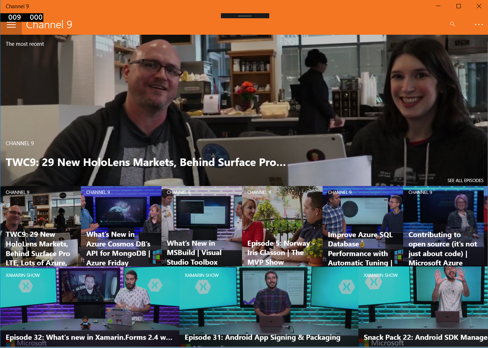
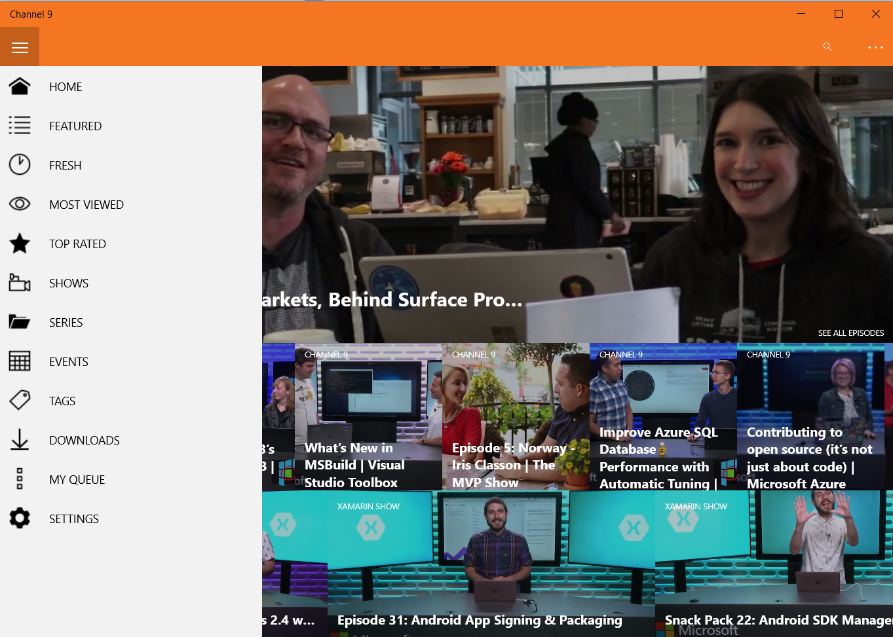
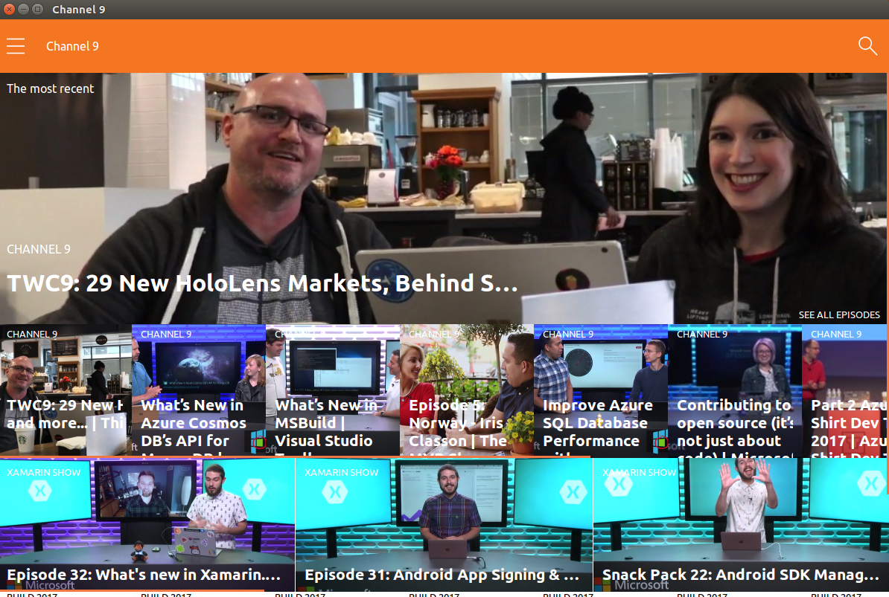
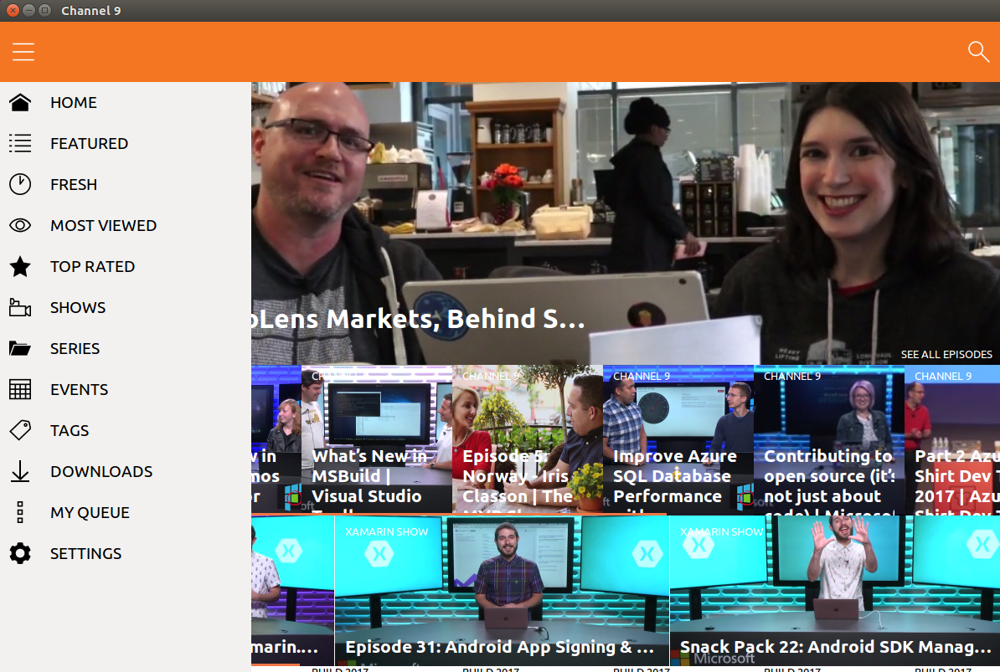

# Xamarin.Channel 9

**Channel 9** Application made with **Xamarin.Forms**.

*Work in progress!*

## The result

### UWP

 

### GTK

 

## Xamarin.Forms 3.0 Feed

The **Xamarin.Forms 3.0** preview is published to a custom NuGet feed. To get it:

- Add a new source to your NuGet Manager: [https://www.myget.org/F/xamarinforms-dev/api/v3/index.json](https://www.myget.org/F/xamarinforms-dev/api/v3/index.json).
- Check Pre-Release.
- Select and install the package with the  name **3.0.0.201-gtk**.

## Notes

The purpose of this demo is simply to show how you can create nice UI in Xamarin.Forms. Channel 9 is used as a reference but this is NOT the official Channel 9 App.

## Setup

Download or clone the repository. This is a solution with two projects.

Rebuild the solution to get all neccesary NuGet packages.

**Enjoy!**

## Copyright and license

Code released under the [MIT license](https://opensource.org/licenses/MIT).